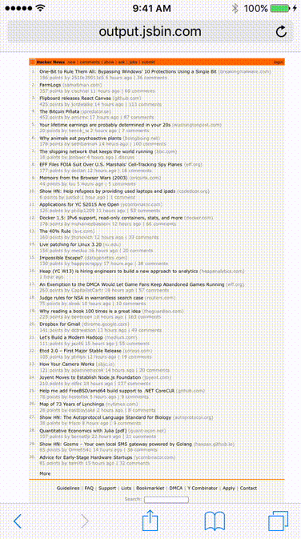

A lightweight javascript library to provide Desktop-like zooming by pinch.

## Usage

```
<script src="pinch.js"></script>
```

Although not required it is better to set the initial viewport.

```
<meta name="viewport" content="width=device-width, initial-scale=1">
```

## Demo

Click [here](http://jsbin.com/keloba) for demo.



## License

pinch.js is freely distributable under the terms of the [MIT license](https://github.com/vagrawal/pinch/blob/develop/LICENSE).

[license-image]: http://img.shields.io/badge/license-MIT-blue.svg?style=flat
[license-url]: LICENSE

